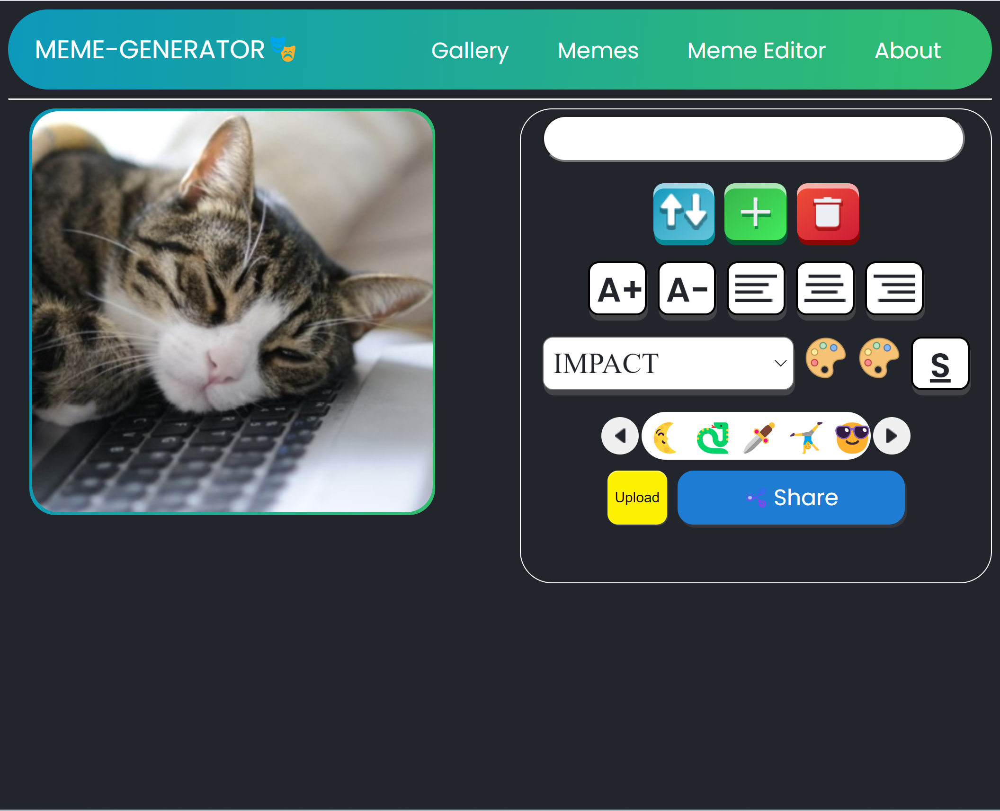

# Meme Generator

 My second project in Coding Academy FullStack bootcamp. Made with vanila JS and basic css, with emphasis on canvas. With this meme generator,
you can create,edit and delelte your memes. [Check it out](https://esheleyni.github.io/meme-generator/) 
 

## How it looks

